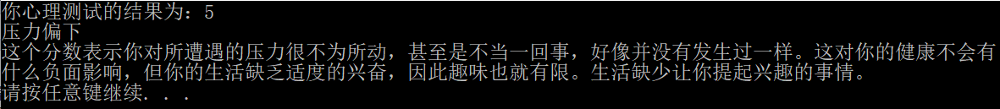

# OHW组总结md  
## 汪泽旸的demo   
1. 某天是什么日子小程序  
2. 运行文件夹中的程序  
依次输入年份+空格+月份+空格+日期，再敲打回车键后程序开始运行计算  
程序会依次显示**是否为闰年、这天是该年第几天、是什么星座**的信息
3. 运行示例图如下  

4. 作者：汪泽旸
## 谢谢大家的阅读
  
  
## 李瑶璐的demo
## 该demo实现的功能
这个python小程序可以导入.xlsx文件中的数据，再由用户在控制台输入图的横坐标及纵坐标、图表标题、图表类型，从而输出用户想要的表格。
## 该demo使用的库文件
**matplotlib**这一模块可以实现简单的统计向画图功能，而导入并提取excel表格文件中的数据需要用到**xlrd**模块。
## 代码的具体实现
### 1. 定义图表函数
虽然matplotlib提供了现成的画图表函数，但是为了方便后面进行类型选择的代码编写，打算使用`def`来进行每种图画图过程的封装。
### 2. 提取表格文档数据
首先打开所需的工作簿，然后对工作表进行遍历并提取具体数据。

值得一提的是，xlrd模块中的append函数在工作表中直接提取出来的数据是一个二维数组，即使你提取的仅有一行数据。而matplotlib的画图功能仅能输入一维数组，因此对提出来的数组还要用for循环再append一次，才能得到想要的结果。
### 3. 输入图表坐标说明文字
由于仅仅是在控制台输入，该功能用最简单的`print`即可实现。不过python一般情况下不支持中文，所以要成功输入中文就要在前面加一行`#-*-coding:utf-8-*-`。
### 4. 进行图表类型选择
python没有switch函数，但可以通过编写一个字典，然后通过`choice`函数来实现选择的功能。
## 不足与改进
这个demo虽然能解决这个图表打印的简单层面问题，但是还有不少深入的部分需要解决，比如图表其他元素的设置（颜色等）；而且它只能打印表格的前两列数据，如何根据用户需求打印其他列的数据也是一个要解决的问题。代码简洁性亦需要加强。后面将会在新的版本中解决这些问题。
## *谢谢大家的阅读*
  
    

## 于启辰的demo
## 作用
此程序主要作用是对学生信息进行输入，查询和修改。先将学生信息诸如学号，姓名，住址，寝室进行依次输入，再通过以姓名，学号等关键词进行查询，进而进行修改。  
## 如何运行
----
1. 调试运行程序
2. 进行选择  
    1. 输入学生信息  
    2. 显示学生信息  
    4. 查询学生信息  
    2. 统计学生信息
    6. 删除学生信息
    3. 修改学生信息
    7. 清理屏幕
    6. 退出系统  
4. 根据指示进行下一步动作  
   
# 倪宇璇的Demo
## 简单压力测试
这个程序是一个简单的压力小测试，测试开始以后，通过让用户回答十个题目，计算得到分数，再由分数匹配得到相对的压力等级及其描述内容，测试就此结束。
#3 程序的实现
### 1.题目顺序控制函数
在函数中设置一个整型数，调用该函数，整型数的值不同会呈现不同的题目。在程序中数为不同的值的时候分别调用这个函数，就可以实现不同题目的呈现。
### 2.不同结果显示函数
在函数中设置一个浮点数，该浮点数在不同范围内时对应显示不同的内容。在程序中调用该函数就可以显示不同的结果。
### 3.初始界面的显示
初始界面显示“简单压力测试”，并提示“按任意键开始答题”，用户按任意键就清屏。
### 4.测试过程
设置整型数k、浮点数score以及字符串answer，编一个循环并在每次循环中通过k调用题目显示函数，并使显示题目之后输入合适的答案才能进入下一题的回答，若答案不合适则一直在对应题目的位置不动，每次输入合适的答案score的值就做一次更新得到分数，十道题目回答完以后退出该循环。
### 5.结果的显示
通过score调用结果显示函数，得到最终的结果。
## 程序测试
### 1.初始页面测试
运行程序以后，显示初始页面，按任意键跳入答题过程，测试通过。

### 2.答题过程测试
题目跳出正常，回答时输入“A”或“B”或“C”则进入下一道题目，输入其他内容则跳出提示重新回答，每回答一道题目清屏再出现下一题，一共十题，则测试通过。

### 3.结果显示测试
十道题目都回答完以后，清屏再出现对应结果，则测试通过。

## 作者
倪宇璇 气卓1601 U201613526
# 谢谢阅读！！

# 郑卓的demo    
## 高精度实数减法运算
## Visual Studio或其他cpp编译器
### 1. Usage：打开ZzDemo.exe运行程序按照要求输入两个高精度实数，进行运算，得到结果。
### 2. Example：