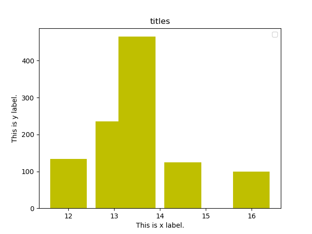
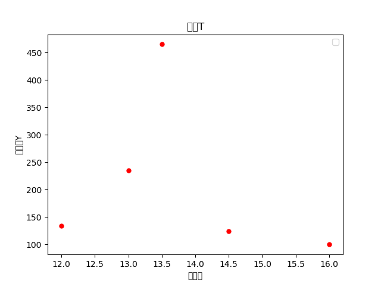

# U201612041 李瑶璐的demo
## 该demo实现的功能
这个python小程序可以导入.xlsx文件中的数据，再由用户在控制台输入图的横坐标及纵坐标、图表标题、图表类型，从而输出用户想要的表格。
## 该demo使用的库文件
**matplotlib**这一模块可以实现简单的统计向画图功能，而导入并提取excel表格文件中的数据需要用到**xlrd**模块。
## 代码的具体实现
### 1. 定义图表函数
虽然matplotlib提供了现成的画图表函数，但是为了方便后面进行类型选择的代码编写，打算使用`def`来进行每种图画图过程的封装。
### 2. 提取表格文档数据
首先打开所需的工作簿，然后对工作表进行遍历并提取具体数据。

值得一提的是，xlrd模块中的append函数在工作表中直接提取出来的数据是一个二维数组，即使你提取的仅有一行数据。而matplotlib的画图功能仅能输入一维数组，因此对提出来的数组还要用for循环再append一次，才能得到想要的结果。
### 3. 输入图表坐标说明文字
由于仅仅是在控制台输入，该功能用最简单的`print`即可实现。不过python一般情况下不支持中文，所以要成功输入中文就要在前面加一行`#-*-coding:utf-8-*-`。
### 4. 进行图表类型选择
python没有switch函数，但可以通过编写一个字典，然后通过`choice`函数来实现选择的功能。
### **该demo的具体代码如下：**
```python
#-*-coding:utf-8-*-
import xlrd
import matplotlib.pyplot as plt
def tiaoxingtu():
    plt.bar(num_1,num_2,color='y')
    plt.legend()
    plt.xlabel(tex_x)
    plt.ylabel(tex_y)
    plt.title(tex_tit)
    plt.show()
def sandiantu():
    plt.scatter(num_1,num_2, color='r', s=25)
    plt.xlabel(tex_x)
    plt.ylabel(tex_y)
    plt.title(tex_tit)
    plt.legend()
    plt.show()
def duidietu():
    plt.stackplot(num_1, num_2, colors='m')
    plt.xlabel(tex_x)
    plt.ylabel(tex_y)
    plt.title(tex_tit)
    plt.show()
file=input('请输入表格位置:')
sheet_index=0
workbook = xlrd.open_workbook(file)
sheet = workbook.sheet_by_index(sheet_index)
print("工作表名称:", sheet.name)
print("行数:", sheet.nrows)
print("列数:", sheet.ncols)
num_11= []
num_22= []
num_1=[]
num_2=[]
num_11.append(sheet.col_values(0))
num_22.append(sheet.col_values(1))

for m in range(0,1):

    for i in num_11[m]:

        num_1.append(i)

for m in range(0,1):

    for i in num_22[m]:

        num_2.append(i)

print(num_1)
print(num_2)
tex_x = input("输入横坐标: ")
print("横坐标为:",tex_x)
tex_y= input("输入纵坐标: ")
print("纵坐标为:",tex_y)
tex_tit=input("输入图表标题：")
print("标题为:",tex_tit)
tex_tp=input("输入类型 :1 条形图 2 散点图 3 堆叠图")
choice = { '1' : tiaoxingtu, '2' : sandiantu, '3': duidietu }
if tex_tp in choice:
    choice[tex_tp]()
else: print("没有适合的类型")
```
## 代码具体输出示例




然而matplotlib也不支持默认中文输入，即使编码最开头做了设置。要想解决这一问题，需要启用字体管理器，这个问题会在后面的版本做出修改。




## 不足与改进
这个demo虽然能解决这个图表打印的简单层面问题，但是还有不少深入的部分需要解决，比如图表其他元素的设置（颜色等）；而且它只能打印表格的前两列数据，如何根据用户需求打印其他列的数据也是一个要解决的问题。代码简洁性亦需要加强。后面将会在新的版本中解决这些问题。
## *谢谢大家的阅读*