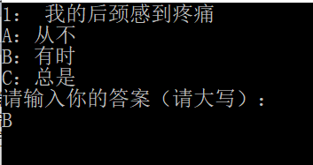
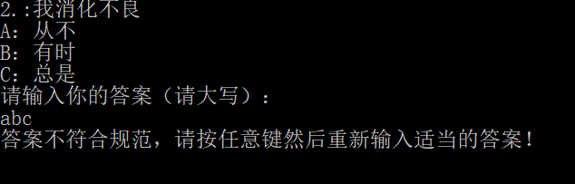

# U201613526倪宇璇的Demo
## 简单压力测试
这个程序是一个简单的压力小测试，测试开始以后，通过让用户回答十个题目，计算得到分数，再由分数匹配得到相对的压力等级及其描述内容，测试就此结束。
#3 程序的实现
### 1.题目顺序控制函数
在函数中设置一个整型数，调用该函数，整型数的值不同会呈现不同的题目。在程序中数为不同的值的时候分别调用这个函数，就可以实现不同题目的呈现。
### 2.不同结果显示函数
在函数中设置一个浮点数，该浮点数在不同范围内时对应显示不同的内容。在程序中调用该函数就可以显示不同的结果。
### 3.初始界面的显示
初始界面显示“简单压力测试”，并提示“按任意键开始答题”，用户按任意键就清屏。
### 4.测试过程
设置整型数k、浮点数score以及字符串answer，编一个循环并在每次循环中通过k调用题目显示函数，并使显示题目之后输入合适的答案才能进入下一题的回答，若答案不合适则一直在对应题目的位置不动，每次输入合适的答案score的值就做一次更新得到分数，十道题目回答完以后退出该循环。
### 5.结果的显示
通过score调用结果显示函数，得到最终的结果。
***
### 程序代码
```C#
using System;
using System.Collections.Generic;
using System.Linq;
using System.Text;
using System.Threading.Tasks;

namespace ConsoleApp1
{
    public class Program
    {
        public static void Total(int i)
        {
            switch(i)
            {
                case 1:
                    Console.Write("1： 我的后颈感到疼痛\nA：从不\nB：有时\nC：总是\n");
                    break;
                case 2:
                    Console.Write("2.:我消化不良\nA：从不\nB：有时\nC：总是\n");
                    break;
                case 3:
                    Console.Write("3：我耳中有嗡嗡声\nA：从不\nB：有时\nC：总是\n");
                    break;
                case 4:
                    Console.Write("4： 我对自己说话\nA：从不\nB：有时\nC：总是\n");
                    break;
                case 5:
                    Console.Write("5：我得眼睛又酸又累\nA：从不\nB：有时\nC：总是\n");
                    break;
                case 6:
                    Console.Write("6：我觉得不快乐\nA：从不\nB：有时\nC：总是\n");
                    break;
                case 7:
                    Console.Write("7：我心情不安，无法静坐\nA：从不\nB：有时\nC：总是\n");
                    break;
                case 8:
                    Console.Write("8：我对自己没有信心\nA：从不\nB：有时\nC：总是\n");
                    break;
                case 9:
                    Console.Write("9：我很难入睡\nA：从不\nB：有时\nC：总是\n");
                    break;
                case 10:
                    Console.Write("10：我发现自己很容易哭\nA：从不\nB：有时\nC：总是\n");
                    break;
            }
        }
        public static void Result(double s)
        {
            if (s >= 8 && s <= 10)
            {
                Console.WriteLine("高压力\n这个分数表示是你正承受太多的压力，这正在损害你的健康，并令你的人际关系发生问题。你的行为会伤害自己，也会影响其他人。因此，对你来说，学会如何减除自己的压力反应是非常必要的。你可能必须花时间做练习，学习控制压力，也可以寻求专业的帮助。");
            }
            else if (s >= 6 && s < 8)
            {
                Console.WriteLine("压力适中\n这个分数指出你生活中的兴奋与压力也许是相当适中的。偶尔会有一段时间压力太大，但你也许有能力去享受压力，并且很快回到平衡状态，因此对你的健康不会造成威胁。你很容易与人相处，可以毫无惧怕地担任工作，也没有失去信心。");
            }
            else if (s >= 3 && s < 6)
            {
                Console.WriteLine("压力偏下\n这个分数表示你对所遭遇的压力很不为所动，甚至是不当一回事，好像并没有发生过一样。这对你的健康不会有什么负面影响，但你的生活缺乏适度的兴奋，因此趣味也就有限。生活缺少让你提起兴趣的事情。");
            }
            else
            {
                Console.WriteLine("对于生活感觉无趣\n如果你的分数值落在这个范围内，你的生活可能是相当沉闷的，即使刺激或有趣的事情发生了，你也很少作反应。可能你必须参加更多的社会活动或娱乐活动，以增加你的压力激活反应。");            
            }
        }

        static void Main(string[] args)
        {
            Console.WriteLine("简单压力测试");
            Console.WriteLine("按任意键开始答题");
            Console.ReadKey(true);
            Console.Clear();
            int k = 1;
            double score = 0;
            string answer;
            do
            {
                Total(k);
                Console.WriteLine("请输入你的答案（请大写）：");
                answer = Console.ReadLine();
                if (answer == "A")
                {
                    score += 0;
                    k++;
                    Console.Clear();
                }
                else if (answer == "B")
                {
                    score += 0.5;
                    k++;
                    Console.Clear();
                }
                else if (answer == "C")
                {
                    score += 1;
                    k++;
                    Console.Clear();
                }
                else
                {
                    Console.WriteLine("答案不符合规范，请按任意键然后重新输入适当的答案！");
                    Console.ReadKey(true);
                    Console.Clear();
                    continue;
                }
            } while (k >= 1 && k <= 10);
            Console.WriteLine("你心理测试的结果为：{0}",score);
            Result(score);
        }

    }
}
```
***
## 程序测试
### 1.初始页面测试
运行程序以后，显示初始页面，按任意键跳入答题过程，测试通过。

### 2.答题过程测试
题目跳出正常，回答时输入“A”或“B”或“C”则进入下一道题目，输入其他内容则跳出提示重新回答，每回答一道题目清屏再出现下一题，一共十题，则测试通过。


### 3.结果显示测试
十道题目都回答完以后，清屏再出现对应结果，则测试通过。

## 作者
倪宇璇 气卓1601 U201613526
# 谢谢阅读！！